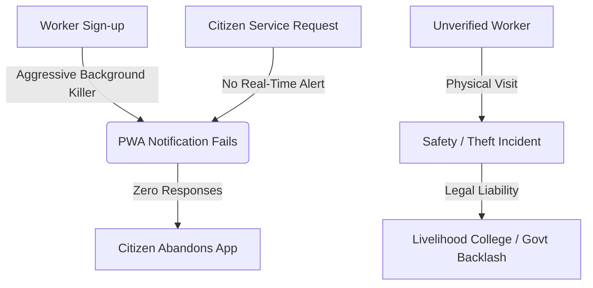
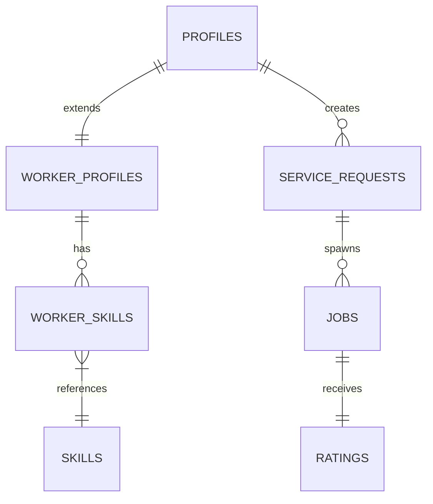

# DLWEP Strategic Audit & Execution Blueprint

**District Livelihood Workforce & Employment Exchange Platform (DLWEP)**  
*Prepared by Antigravity (Elite Product Strategist & Systems Architect)*

---

## Executive Summary

The **District Livelihood Workforce & Employment Exchange Platform (DLWEP)** is a highly ambitious, low-cost district workforce operating system. While the vision of connecting training to local employment with near-zero administrative costs is noble, **the current PRD and SOP have fatal design assumptions**—most notably regarding user adoption, communication limits in rural settings, and trust/verification safety risks.

This document provides a **brutal gap analysis** (Phase 1), **architectural and operational counter-proposals** (Phase 2), and a **concrete 4-week execution blueprint** (Phase 3) to turn this system into a resilient, self-operating platform.

---

## Phase 1: The Critical Audit (PRD & SOP Feedback)

### 1. PRD Critique: Structural & Market Gaps



#### A. The Communication and Notification Paradox (High Risk)
*   **The PRD Constraint:** *"Avoid: SMS APIs, WhatsApp APIs for Phase 1. Free notifications only (Browser/Email)."*
*   **The Brutal Reality:** 
    *   Blue-collar workers (drivers, electricians, plumbers) in rural districts do not check email.
    *   PWA/Web Push notifications on budget Android phones (Xiaomi, Realme, Vivo, Transsion) are systematically killed by aggressive OS battery-saving daemons.
    *   **Failure Mode:** If workers never receive the matching alerts in real-time, matching response rates will hover near 0%. Citizens will wait hours for a response, deem the platform broken, and uninstall it.
*   **Verdict:** SMS or an alternative low-cost instant notification channel is **non-negotiable** for launch.

#### B. The Zero-Vetting Trust Liability (Critical Risk)
*   **The PRD Constraint:** *"No manual approval workflow. Trust generated automatically."*
*   **The Brutal Reality:**
    *   In a district-level service marketplace, workers physically enter citizens' private homes. 
    *   If any malicious actor can sign up as an electrician with a fake photo and name, get matched, and commit a crime (theft, assault) at a citizen's house, the **Livelihood College and District Government will face severe legal liability and public relations damage**.
    *   Relying on a "Livelihood Certified" badge is insufficient because the PRD allows *uncertified* workers to sign up and take jobs.
*   **Verdict:** The platform must have a minimal gatekeeping step—such as Aadhaar e-KYC or mandatory digital onboarding verification by Livelihood College admins before a profile goes active.

#### C. Tech Literacy and Voice UI
*   **The PRD Assumption:** Workers will self-onboard, manage their own profiles, write descriptions, and toggle "Active/Busy" statuses.
*   **The Brutal Reality:** 
    *   Many skilled workers in rural areas have low digital literacy. Navigating complex multi-step forms in English (or even written regional languages) is a barrier.
*   **Verdict:** The onboarding flow must be highly visual, multilingual, and voice-assisted.

#### D. Geo-location Accuracy in Rural India
*   **The PRD Constraint:** Using OpenStreetMap/Leaflet to capture village-level coordinates.
*   **The Brutal Reality:** 
    *   OSM has poor geospatial data for rural roads, landmarks, and village boundaries in India compared to Google Maps.
    *   Villagers do not know their latitude/longitude.
*   **Verdict:** The system should match based on administrative hierarchies first (District -> Block -> Village/Ward name matching) rather than raw GPS coordinates.

---

### 2. SOP Critique: Architectural & Database Flaws

#### A. Fragmented User/Worker Database Schema
The schema outlines `Users`, `Workers`, and `Contractors` separately. This creates unnecessary overhead and normalization drift:
*   A `user` can have a role of `worker` or `contractor`. However, having separate `Workers` and `Contractors` tables means redundant user profiles.
*   `Enrollments` references `student_id`, but there is no `Students` table. It assumes students are defined as a role in `Users`, which causes query fragmentation.

#### B. Synchronous Matching Engine Bottlenecks
*   The SOP defines `POST /matching/run/{requestId}`. Running matching synchronously in an API call is dangerous:
    *   If a request takes 10 seconds to compute distances, match skills, and query the DB, the HTTP request will time out on Vercel (10-second serverless execution limit).
    *   It should be an **asynchronous event-driven flow** triggered by a Supabase Database Webhook or Edge Function.

#### C. Rating & Trust Abuse (Vulnerability)
*   The Trust Engine deducts points: `No Show: -15`, `Complaint: -10`.
*   There is no verification for these complaints. A competitor worker could easily register fake citizen accounts, request a worker, mark them as a no-show, and systematically destroy their rating.

---

## Phase 2: Architectural Suggestions & Enhancements

To fix these gaps, we propose a set of unconventional, defensible feature angles and technical optimizations.

```
┌─────────────────────────────────────────────────────────────────┐
│                     PROPOSED ARCHITECTURE                       │
└─────────────────────────────────────────────────────────────────┘
                                 │
         ┌───────────────────────┴───────────────────────┐
         ▼                                               ▼
┌──────────────────────────────┐                ┌──────────────────────────────┐
│     LIVELIHOOD MITRA APP     │                │     SMS GATEWAY APP (FREE)   │
│   (Community Proxy Agent)    │                │  (Local Android SIM Broker)  │
├──────────────────────────────┤                ├──────────────────────────────┤
│ Helps illiterate/offline     │                │ Bypasses expensive APIs like │
│ workers register and receive │                │ Twilio; sends local SMS      │
│ job notifications manually.  │                │ alerts directly via SIM.     │
└──────────────────────────────┘                └──────────────────────────────┘
```

### 1. The "Livelihood Mitra" (Proxy Agent) Model
*   **Unconventional Defensibility:** To solve the tech literacy barrier, add a role: **Livelihood Mitra (Community Agent)**.
*   Mitras are tech-savvy college students or village representatives. 
*   They get a special dashboard to:
    *   Register offline workers in their village.
    *   Receive job notifications on behalf of offline workers.
    *   Call the worker via phone call to dispatch them, and log the job completion status on the app.
    *   *Benefit:* Earns the college high local credibility and creates a human-in-the-loop fallback network that prevents system failure.

### 2. The Free SMS Gateway Alternative
*   **Cost Optimization:** Avoid expensive Twilio/WhatsApp APIs by setting up a cheap Android phone in the Livelihood College office.
*   Run a free, open-source Android SMS Gateway app (e.g., *SMS Gateway API* or *SmsSync*).
*   Your Supabase Edge Function sends a standard HTTP POST request to this local Android device, which transmits the SMS alert to the worker's basic phone using a cheap, unlimited SMS SIM card.
*   *Benefit:* 100% free notifications for workers who don't have active internet/smartphones.

### 3. PostgreSQL PostGIS Spatial Indexing
Instead of manual distance calculations in JS, enable the `postgis` extension in Supabase:
```sql
CREATE EXTENSION IF NOT EXISTS postgis;

-- Spatial queries become instant:
SELECT worker_id, ST_Distance(worker_geom, request_geom) AS distance
FROM workers
WHERE ST_DWithin(worker_geom, request_geom, 10000) -- within 10km radius
ORDER BY distance ASC;
```

### 4. Consolidated Schema & Auditing
Replace the fragmented tables with a clean, unified profile schema and an Audit trail:
*   `profiles` (linked to `auth.users`): contains basic details and `role` (enum: citizen, worker, contractor, student, agent, staff).
*   `worker_profiles`: extends `profiles` for worker-specific properties (trust_score, certificates, skills).
*   `audit_logs`: records every status change, rating, and complaint for fraud prevention.

---

## Phase 3: The Execution Blueprint

### 1. Unified Database Schema Design (PostgreSQL)



```sql
-- Core Schema Blueprint (Supabase PGSQL)

-- 1. Profiles Table (Unified)
CREATE TYPE user_role AS ENUM ('citizen', 'worker', 'contractor', 'student', 'agent', 'staff');

CREATE TABLE profiles (
    id UUID REFERENCES auth.users ON DELETE CASCADE PRIMARY KEY,
    name TEXT NOT NULL,
    mobile TEXT UNIQUE NOT NULL,
    email TEXT UNIQUE,
    role user_role NOT NULL DEFAULT 'citizen',
    district TEXT NOT NULL,
    block TEXT NOT NULL,
    village TEXT NOT NULL,
    created_at TIMESTAMP WITH TIME ZONE DEFAULT TIMEZONE('utc'::text, NOW()) NOT NULL
);

-- 2. Worker Profiles
CREATE TYPE availability_status AS ENUM ('active', 'busy', 'offline');

CREATE TABLE worker_profiles (
    id UUID REFERENCES profiles(id) ON DELETE CASCADE PRIMARY KEY,
    photo_url TEXT,
    experience_years INT DEFAULT 0,
    availability availability_status DEFAULT 'offline' NOT NULL,
    trust_score INT DEFAULT 10 NOT NULL, -- Starts at 10 (Bronze)
    rating_average NUMERIC(3,2) DEFAULT 0.00,
    jobs_completed INT DEFAULT 0,
    is_verified BOOLEAN DEFAULT FALSE -- Mandatory vetting flag
);

-- 3. Skills Registry
CREATE TABLE skills (
    id BIGSERIAL PRIMARY KEY,
    name TEXT NOT NULL UNIQUE,
    category TEXT NOT NULL
);

-- 4. Worker Skills Link
CREATE TABLE worker_skills (
    worker_id UUID REFERENCES worker_profiles(id) ON DELETE CASCADE,
    skill_id BIGINT REFERENCES skills(id) ON DELETE CASCADE,
    is_primary BOOLEAN DEFAULT FALSE,
    PRIMARY KEY (worker_id, skill_id)
);

-- 5. Service Requests (With PostGIS Point support)
CREATE TYPE request_status AS ENUM ('created', 'matched', 'worker_selected', 'completed', 'cancelled', 'auto_closed');

CREATE TABLE service_requests (
    id UUID DEFAULT gen_random_uuid() PRIMARY KEY,
    customer_id UUID REFERENCES profiles(id) ON DELETE SET NULL,
    service_category TEXT NOT NULL,
    description TEXT,
    location TEXT NOT NULL,
    geom GEOMETRY(Point, 4326), -- PostGIS point
    status request_status DEFAULT 'created' NOT NULL,
    created_at TIMESTAMP WITH TIME ZONE DEFAULT TIMEZONE('utc'::text, NOW()) NOT NULL
);

-- 6. Jobs Lifecycle
CREATE TYPE job_status AS ENUM ('assigned', 'in_progress', 'completed', 'auto_closed');

CREATE TABLE jobs (
    id UUID DEFAULT gen_random_uuid() PRIMARY KEY,
    request_id UUID REFERENCES service_requests(id) ON DELETE CASCADE,
    worker_id UUID REFERENCES worker_profiles(id) ON DELETE SET NULL,
    customer_id UUID REFERENCES profiles(id) ON DELETE SET NULL,
    status job_status DEFAULT 'assigned' NOT NULL,
    started_at TIMESTAMP WITH TIME ZONE,
    completed_at TIMESTAMP WITH TIME ZONE
);
```

---

### 2. 4-Week MVP Milestone Plan

Here is the concrete roadmap designed to ensure the system is functional and stable before adding scaling features.

#### **Week 1: Core System & Verification Engine**
*   **Goal:** Build database, core schemas, authentication, and worker profile onboarding with verification checks.
*   **Tasks:**
    1. Set up Supabase project, run the schema migration with RLS rules.
    2. Build Auth UI (Next.js, Tailwind, Shadcn) using Mobile/OTP or password login.
    3. Implement Citizen & Worker registration flow.
    4. Implement **Admin Verification Panel** for Livelihood College staff to review registered workers and mark them `is_verified: true` before they appear in matches.
*   **Deliverable:** Working authentication and worker dashboard with pending/active status tracking.

#### **Week 2: Matching Engine & Service Requests**
*   **Goal:** Implement the PostGIS matching engine and the request creation flow.
*   **Tasks:**
    1. Implement "Create Request" form with interactive OSM Map/Leaflet coordinate capture.
    2. Write the PostgreSQL PL/pgSQL function for matching workers based on distance, rating, certification, and verification status.
    3. Implement matching status update logic (ServiceRequestWorkers mapping table).
*   **Deliverable:** Service requests are automatically matched to the nearest 5 verified, available workers.

#### **Week 3: Notification Hub & Job Lifecycle**
*   **Goal:** Connect workers and citizens through free alerts and complete the offline job lifecycle.
*   **Tasks:**
    1. Integrate **Web Push Notifications** (VAPID Vercel edge framework) for PWA users.
    2. Build the **SMS Gateway edge function webhook** mapping alerts to the local Android gateway phone.
    3. Build the job execution board: "Accept Job", "Worker Selected", "Mark Completed".
    4. Implement automatic job-expiration cron tasks via Supabase `pg_cron`.
*   **Deliverable:** Worker receives SMS or web notification when matched, accepts it, and citizen gets notified to lock in the booking.

#### **Week 4: Feedback Loop & Analytics Dashboard**
*   **Goal:** Implement rating reviews, basic dashboard analytics, and government placement reports.
*   **Tasks:**
    1. Build rating and review workflow with trust score updates.
    2. Build Livelihood College dashboard showing critical KPIs (Total jobs completed, placement conversion, top skills demanded).
    3. Run full end-to-end integration and PWA lighthouse optimization checks.
*   **Deliverable:** Complete MVP with verified training conversion report and successful job lifecycle completion.

---

### 3. Post-MVP Feature Backlog (Deferred to Phase 2+)
1. **Contractor Portal:** Bulk/team hiring for construction projects (deferred to focus on 1-to-1 consumer matching).
2. **Batch & Training Course Management:** Offline batches can be maintained manually by Livelihood College admins during MVP; integration can wait till core marketplace is solid.
3. **Advanced Geographic Heatmaps:** Block and village analytics maps can be deferred in favor of tabular CSV reports.
